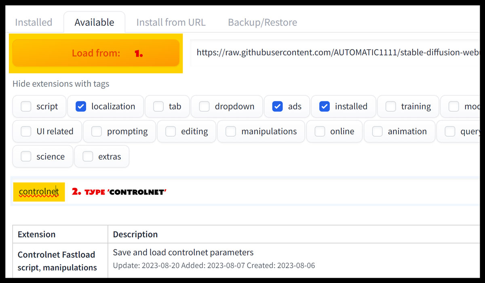

<!-- vim: set foldmethod=marker fmr=###,--- :-->

### controlnet

https://andyhtu.com/how-to-install-controlnet-automatic1111-a-comprehensive-guide/

To see the images:

change `https://goldeyes.net/wpmedia/andyhtu/` to `https://andyhtu.com/wp-content/`

> replace everything up to `uploads`

* * *

One step is using the Automatic1111 Web UI, and the other step is using GitHub Desktop. Follow the method that best suits you.

**Option 1 – Using the Automatic1111 Web UI:**

1. Open up your Automatic1111 Web UI.
2. Go to the Extensions Tab > Available tab > click “Load From.”
3. In the search bar,
4. Type in “controlnet.” You’ll see “sd_webui_controlnet” listed below.
5. Click on “Install” to the right side.
6. Go to the “Installed” tab > Apply and restart UI.

Done!

---

other
 

#### other

https://github.com/Mikubill/sd-webui-controlnet.git

cd ~/stable ... extensions/
git clone https://github.com/Mikubill/sd-webui-controlnet.git

there was  lot of downloading, but it looks like I chould have cloned it
https://huggingface.co/docs/hub/en/repositories-getting-started

https://github.com/lllyasviel/ControlNet/issues/149
try this
delete the Controlnet folder from your extensions. then after restarting Ui you have to do 2steps:
1.install it from url: paste https://github.com/lllyasviel/ControlNet.git
2.install it from available extensions. look for controlnet and install the one with 1200steps or more!

"st webui controlnet maniupulations" with 17000+ start

https://github.com/lllyasviel/ControlNet

install from URL

https://www.reddit.com/r/StableDiffusion/comments/119o71b/a1111_controlnet_extension_explained_like_youre_5/

downloaded all from https://huggingface.co/webui/ControlNet-modules-safetensors/tree/main
moved to extensions/contorlnet/models
restarted UI

https://www.reddit.com/r/StableDiffusion/comments/12na7ic/controlnet11_arrived_in_a1111_extension/

https://huggingface.co/lllyasviel/ControlNet-v1-1/tree/main

https://www.reddit.com/r/StableDiffusion/comments/11cwiv7/collected_notes_and_observations_on_controlnet/

---

