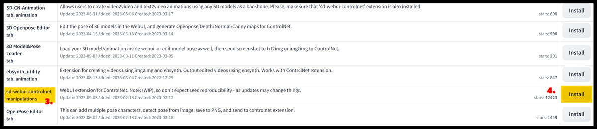
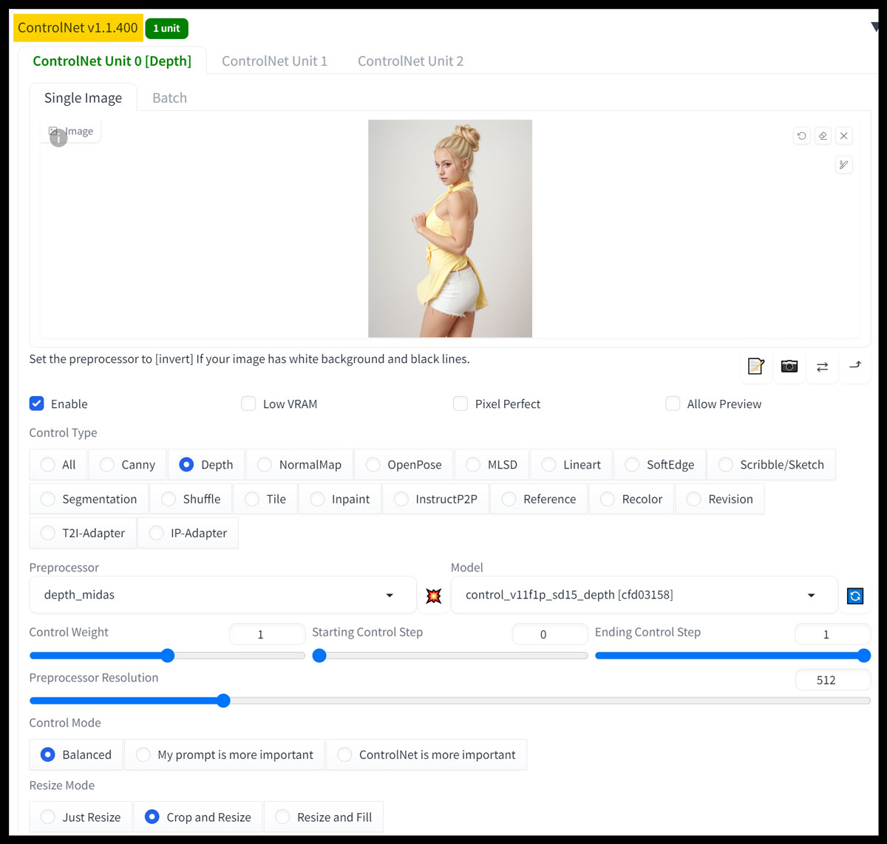

<!-- vim: set foldmethod=marker fmr=###,--- :-->

### controlnet

[Andy Hu's tutorial](https://andyhtu.com/how-to-install-controlnet-automatic1111-a-comprehensive-guide/)

> Image can be repared by changing `https://goldeyes.net/wpmedia/andyhtu/` to `https://andyhtu.com/wp-content/`

---

### Step 1: Installing ControlNet

One step is using the Automatic1111 Web UI, and the other step is using GitHub Desktop. Follow the method that best suits you.





**Option 1 – Using the Automatic1111 Web UI:**

1. Open up your Automatic1111 Web UI.
2. Go to the Extensions Tab > Available tab > click “Load From.”
3. In the search bar,
4. Type in “controlnet.” You’ll see “sd_webui_controlnet” listed below.
5. Click on “Install” to the right side.
6. Go to the “Installed” tab > Apply and restart UI.

* * *

**Option 2 – For GitHub Desktop Users:**

This method is my preferred way to install, as it’s cleaner and helps tidy things up. You can always uninstall it using this method in case something goes wrong.

Find the Link:

1. Open up your Automatic1111 Web UI  
   - Go to “Extensions” > “Available” > Click “Load From” Search “control” > right-click “sd_webui_controlnet” > copy link Address.
   - The link will be: ” https://github.com/Mikubill/sd-webui-controlnet”
2. In Git:
```
cd ~/Applications/stable-diffusion-webui/extensions
git clone git@github.com:Mikubill/sd-webui-controlnet.git
```
3. Open up Automatic1111 WebUI.

Now you should see a ControlNet option in the main screen under the txt2img and img2img tab. It will also appear on other tabs if you have them installed for other extensions.

---
### Step 2: Installing the Models

You’ll notice that the Preprocessor and Model drop-down menu doesn’t show anything in the models folder. That’s because you’ll now need to install the models for ControlNet.

1. Download the Files:
   - https://huggingface.co/lllyasviel/ControlNet-v1-1/tree/main
   - https://huggingface.co/lllyasviel/sd_control_collection/tree/main (SDXL)
2. You will need both the .yaml file (configuration) and the .pth file (larger, indicated by the “LFS” logo).
   - Click on the down arrow to download all these files.
   - (You don’t need all of them, just the ones you want, but I’d download all to keep the instructions simple.)
3. Drop all files in the Stable Diffusion Automatic1111 installation folder:
   - Extensions > sd-webui-controlnet > models > 
   - drop all the control_V11 .pth and .yml files.
4. Open A1111:
   - All the ControlNet models should now populate under the drop down menu.

You’re now done with Installing ControlNet for Automatic1111.



---

<details><summary>other</summary><br>

#### other

https://github.com/Mikubill/sd-webui-controlnet.git

cd ~/stable ... extensions/
git clone https://github.com/Mikubill/sd-webui-controlnet.git

there was  lot of downloading, but it looks like I chould have cloned it
https://huggingface.co/docs/hub/en/repositories-getting-started

https://github.com/lllyasviel/ControlNet/issues/149
try this
delete the Controlnet folder from your extensions. then after restarting Ui you have to do 2steps:
1.install it from url: paste https://github.com/lllyasviel/ControlNet.git
2.install it from available extensions. look for controlnet and install the one with 1200steps or more!


"st webui controlnet maniupulations" with 17000+ start


https://github.com/lllyasviel/ControlNet

install from URL


https://www.reddit.com/r/StableDiffusion/comments/119o71b/a1111_controlnet_extension_explained_like_youre_5/


downloaded all from https://huggingface.co/webui/ControlNet-modules-safetensors/tree/main
moved to extensions/contorlnet/models
restarted UI


https://www.reddit.com/r/StableDiffusion/comments/12na7ic/controlnet11_arrived_in_a1111_extension/


https://huggingface.co/lllyasviel/ControlNet-v1-1/tree/main


https://www.reddit.com/r/StableDiffusion/comments/11cwiv7/collected_notes_and_observations_on_controlnet/

---

</details>
